# Rahma AI Guardian App

## Architecture and Implementation Plan for Phase 1 and Phase 2

Prepared for client review  
Date: 22 May 2026  
Reference material: Rahma AI App Proposal, Phase 1 and Phase 2 scope, and 21 May 2026 technical discussion notes

---

## 1. Executive Summary

Rahma is planned as a one-touch emergency and care-assistance platform for vulnerable users, starting with elderly and special-care users in Phase 1 and expanding to children, geofencing, pharmacies, and wider language support in Phase 2.

The recommended approach is to build Phase 1 as a controlled emergency-care pilot rather than attempting the full long-term platform immediately. Phase 1 should prove that the user can activate help quickly, the app can capture location and essential profile context, caregivers or responsible receivers are alerted, the event is logged, and the system works safely even when internet connectivity is weak.

Phase 2 should build on those foundations. It should add child safety, geofencing, pharmacy communication, medication supply workflows, multilingual expansion, and selected wearable integration only after Phase 1 proves the emergency workflow, notification reliability, support process, hosting model, and operational monitoring.

Our recommended delivery direction:

- Use native iOS and Android apps for better control over device permissions, background behavior, geolocation, SMS fallback, voice handling, and future wearable integration.
- Use a UAE-hosted cloud architecture as the preferred production model, with AWS UAE Region and a UAE-hosted foundation-model layer as the recommended path. Bedrock with Claude or an equivalent high-quality model is preferred where available; UAE-hosted private models are the fallback if dedicated hosting is mandated.
- Keep offline mode focused on the emergency-critical path: activation, local profile, last/current location, SMS fallback, local event queue, and simple voice/yes-no interaction.
- Use AI to support intent understanding and context capture, not to make unsafe medical decisions in Phase 1.
- Build reusable platform services in Phase 1 so Phase 2 does not require a rebuild.
- Meet any compliance, audit, data handling, or security requirements specifically confirmed by the client or authority stakeholders.

---

## 2. Confirmed Product Scope

### Phase 1: Elderly and Special-Care Emergency Pilot

Target: Controlled pilot for elderly users and users requiring special care.

Core Phase 1 features:

- One-touch emergency activation with press-and-hold protection.
- Voice and visual yes/no interaction running in parallel.
- Arabic and English support.
- Emergency alert creation with timestamp, location, profile summary, and status.
- Caregiver/family notification through push and SMS fallback.
- Receiver dashboard for authority/support/family users.
- Hospital finder using an approved facility directory.
- Medication reminders for the user.
- Offline and weak-network fallback using local data, last known location, SMS, and later sync.
- Audit trail for emergency events, receiver actions, notification status, and support handling.
- Admin/support console for pilot monitoring, false alarm review, and user support.

Phase 1 should avoid:

- Full free-form medical diagnosis.
- Large multilingual launch beyond Arabic and English.
- Pharmacy ordering and payment.
- Continuous route history for children.
- Broad wearable support before device and partner decisions are confirmed.
- Any live authority integration that has not been approved and tested.

### Phase 2: Children, Geofencing, Pharmacy, Scale, and Languages

Target: Platform expansion after Phase 1 foundations are stable.

Core Phase 2 features:

- Child profile module with parent/guardian access.
- School or authorized receiver workflows.
- Safe-zone/geofencing setup and alerts.
- Family member messaging and escalation.
- Pharmacy communication for prescription/dosage supply workflows.
- Medication reminder expansion with missed-dose escalation.
- Multilingual expansion beyond Arabic and English.
- Wearable integration as a controlled workstream, depending on selected devices and APIs.
- Scale readiness for a larger user base.

---

## 3. Recommended High-Level Architecture

Rahma should be implemented as a secure mobile-first platform with five main layers:

1. Mobile apps: Native iOS and Android apps for vulnerable users.
2. Receiver interfaces: Web dashboard for support, authorities, family receivers, and later schools/pharmacies.
3. Backend platform: APIs and services for identity, profiles, emergency events, location, notifications, reminders, hospital directory, audit, and administration.
4. AI and voice layer: On-device lightweight logic for offline fallback and a UAE-hosted foundation-model layer for approved online flows.
5. Integration layer: SMS, push notifications, maps, hospital directories, emergency handoff, pharmacy, school, and future wearable integrations.

```mermaid
flowchart TB
  subgraph Mobile["Native Mobile Apps"]
    UserApp["User App<br/>One-touch button<br/>Voice + visual prompts<br/>Offline fallback"]
    LocalStore["Encrypted Local Store<br/>Minimal profile<br/>Caregiver contacts<br/>Last known location<br/>Queued events"]
    OnDeviceAI["On-device Voice / Intent<br/>Simple commands<br/>Yes/No<br/>Offline prompts"]
  end

  subgraph Access["Access Channels"]
    CaregiverApp["Caregiver View<br/>Alerts + live link"]
    ReceiverWeb["Receiver Dashboard<br/>Support / authority / family"]
    AdminWeb["Admin Console<br/>Pilot monitoring<br/>Configuration"]
  end

  subgraph Backend["Client-approved UAE-hosted Backend"]
    APIGW["API Gateway"]
    Auth["Identity + Role Service"]
    Profile["Profile + Consent Service"]
    Emergency["Emergency Event Service"]
    Location["Location Service"]
    Notify["Notification Service"]
    Reminder["Medication Reminder Service"]
    Hospital["Hospital Directory Service"]
    Audit["Audit + Event Log"]
    AIOrch["AI Orchestration Service"]
    Integration["Integration Adapter Layer"]
  end

  subgraph Data["Data Layer"]
    DB["Encrypted Operational Database"]
    Queue["Event Queue"]
    ObjectStore["Controlled File / Report Storage"]
    Metrics["Monitoring + Dashboards"]
  end

  subgraph External["Approved External / Partner Systems"]
    SMS["SMS Provider"]
    Push["Apple / Google Push"]
    Maps["Maps / Geocoding"]
    EmergencyPartner["Emergency / Authority Handoff"]
    HospitalPartner["Hospital Directory / Facility Data"]
    Pharmacy["Phase 2 Pharmacy Systems"]
    School["Phase 2 School Systems"]
    Wearables["Phase 2 Wearables"]
  end

  UserApp --> LocalStore
  UserApp --> OnDeviceAI
  UserApp --> APIGW
  CaregiverApp --> APIGW
  ReceiverWeb --> APIGW
  AdminWeb --> APIGW
  APIGW --> Auth
  APIGW --> Profile
  APIGW --> Emergency
  Emergency --> Location
  Emergency --> Notify
  Emergency --> Audit
  Emergency --> AIOrch
  Notify --> SMS
  Notify --> Push
  Location --> Maps
  Hospital --> HospitalPartner
  Integration --> EmergencyPartner
  Integration --> Pharmacy
  Integration --> School
  Integration --> Wearables
  Profile --> DB
  Emergency --> DB
  Location --> DB
  Notify --> Queue
  Audit --> ObjectStore
  Audit --> Metrics
```

---

## 3A. How the App Works: Activation to Emergency Handoff

Rahma should be explainable to the client as a simple emergency workflow:

1. Activate Rahma
   - The user presses and holds the main Rahma button for 2 seconds.
   - The hold action prevents accidental taps while still being fast enough in distress.
   - Future activation sources can include silent panic, fall detection, or wearable trigger if approved.

2. Confirm emergency context
   - The app immediately starts the emergency workflow.
   - The app asks one simple voice/visual prompt such as "Are you hurt?" or "Do you need help?"
   - The user can answer by voice or by tapping large Yes/No buttons.
   - If the user is silent or cannot respond, the app escalates safely instead of waiting.

3. Capture location and profile
   - The app captures current GPS/network location where available.
   - If current location is weak, it uses last-known location with timestamp and confidence.
   - The app attaches minimum emergency profile data: language, critical medical flags, allergies, and caregiver contacts.

4. Create emergency event
   - The backend creates a timestamped emergency event.
   - The event contains activation source, user reference, location quality, profile summary, notification status, and current workflow status.

5. Alert caregivers and receivers
   - Caregivers/family and the approved receiver dashboard are alerted immediately.
   - Push notification is used when online.
   - SMS fallback is used where approved and when connectivity is degraded.
   - Target for normal connectivity: start alerting within 10 seconds of activation.

6. Dispatch or handoff
   - If a direct approved authority/emergency API is available, the event packet is sent through that route.
   - If the direct API route is not available for the pilot, Phase 1 should use the client-confirmed receiver dashboard, call-center/manual handoff, or simulator route.
   - This keeps the handoff model operational while the final authority integration route is confirmed.

7. Track, escalate, or close
   - Receivers can acknowledge, message the caregiver, escalate, mark false alarm, or close the event.
   - Every receiver action is written to the event audit timeline.

Recommended authority dispatch position:

- Use the client-confirmed authority or emergency API route wherever it is available.
- Build the emergency packet, receiver dashboard, and audit trail as the shared foundation for every handoff route.
- Keep approved dashboard, call-center, manual handoff, or simulator options as operational fallback paths during pilot validation.
- Switch to direct authority dispatch as soon as the client confirms the approved integration route.

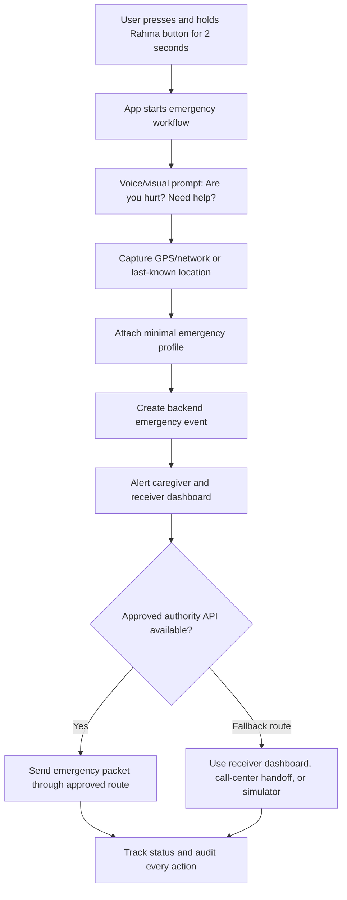

---

## 4. Phase 1 Emergency Flow

The Phase 1 flow must be simple enough for an elderly user in distress. The app should not require typing, menu navigation, or complex decisions.

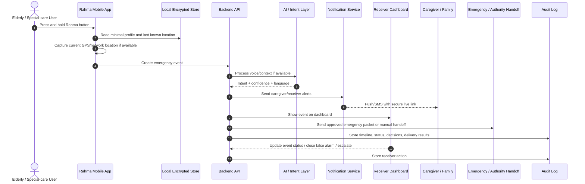

Emergency event packet should include:

- Event ID.
- User ID/reference.
- Name or approved display identifier.
- Age range or profile category if approved.
- Primary language.
- Critical medical flags and allergies.
- Caregiver contacts.
- Current location, last known location, timestamp, and confidence.
- Activation source: button, voice, fallback, or future wearable.
- AI intent context if confidence is sufficient.
- Notification status and receiver status.

---

## 5. Help Must Start Even When the Internet Is Imperfect

Offline mode should not mean that every feature works without internet. It should mean the emergency-critical path degrades safely.

Must work offline:

- Emergency button.
- Local emergency event creation.
- Minimal encrypted local profile.
- Caregiver phone numbers.
- Last known location.
- SMS fallback trigger.
- Local audit queue.

Degraded offline:

- GPS may use current GPS, network location, or last known location.
- Caregiver alert may fall back to SMS.
- Emergency handoff may fall back to SMS and approved manual/receiver-dashboard flow.
- Voice handling should use simple local prompts and yes/no or keyword recognition.

Not recommended offline for Phase 1:

- Full medical triage.
- Complex dialect interpretation.
- Real-time hospital availability.
- Pharmacy ordering.

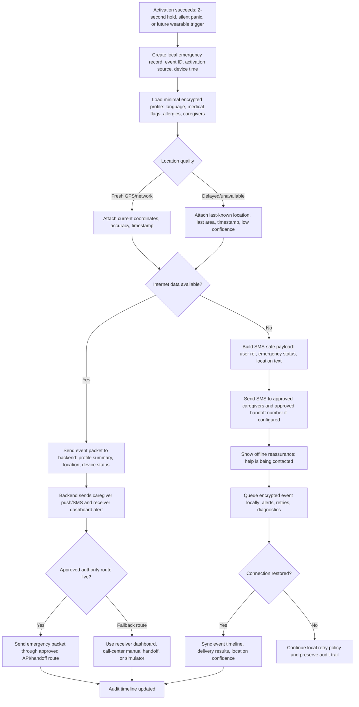

---

## 6. User Experience Flow

The user experience should stay minimal. The user should be able to complete the emergency path through button taps even if voice fails.

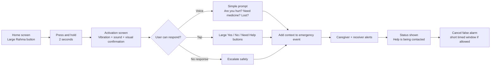

UX principles:

- One primary action on the home screen.
- Press-and-hold to prevent accidental activation.
- Voice and visual buttons available at the same time.
- Haptic and audio feedback for reassurance.
- No typing during emergency flow.
- Large text, high contrast, simple Arabic/English language.
- Clear status after activation.
- False alarm cancellation only if it does not delay emergency handling.

---

## 7. User, Mobile, and Backend Service Design

## 7A. Recommended User Onboarding Flow

Rahma onboarding should be designed for vulnerable users, not only for digitally confident users. The safest approach is to support multiple onboarding routes while keeping one recommended default.

Recommended by us:

- Use UAE Pass as the primary verified identity route for Phase 1 users where the client confirms access and user suitability.
- Use assisted onboarding as the elderly-friendly fallback for users who cannot complete digital onboarding alone.
- Use mobile OTP plus relationship approval for caregivers/family members.
- Use client SSO for staff, admins, support users, and receiver-dashboard users.
- Do not rely on social login for Phase 1 patient, caregiver, emergency, or health-related access.

### Onboarding Options

| Option | Best fit | Condition / risk | Recommendation |
|---|---|---|---|
| UAE Pass | Verified user identity for eligible Phase 1 users | Requires integration access, user readiness, and a fallback for users who cannot complete the process | Recommended primary route for users/patients. |
| Assisted onboarding | Elderly or special-care users who need help from pilot staff, clinic staff, or caregivers | Requires an operating process and staff verification steps | Recommended fallback for Phase 1 pilot. |
| Mobile OTP | Caregivers and family members | Not strong enough alone for sensitive patient identity; must be paired with relationship approval | Recommended for caregiver verification. |
| Client / staff SSO | Admins, support teams, receiver dashboard users, authority/partner staff | Depends on client identity provider readiness and role mapping | Recommended for dashboard and staff users. |
| Manual admin onboarding | Small controlled pilot cohorts | Higher operational workload and audit responsibility | Acceptable only for approved pilot exceptions. |
| Apple/Google social login | Low-risk consumer convenience flows | Weak fit for health/emergency identity and caregiver authorization | Not recommended for Phase 1. |

### Recommended Phase 1 User Onboarding Flow

1. Pilot invite or staff-assisted registration starts the process.
2. User chooses onboarding path: UAE Pass, assisted onboarding, or approved manual pilot setup.
3. Identity is verified and a Rahma user reference is created.
4. Minimal emergency profile is completed: language, medical flags, allergies, caregiver contacts, and medication reminders.
5. Caregivers receive invite and verify by OTP plus relationship approval.
6. App performs permission health check for location, notifications, microphone, and SMS fallback.
7. User completes a guided emergency test in training mode.
8. Account becomes pilot-ready only after profile, caregiver, permissions, and test status are complete.

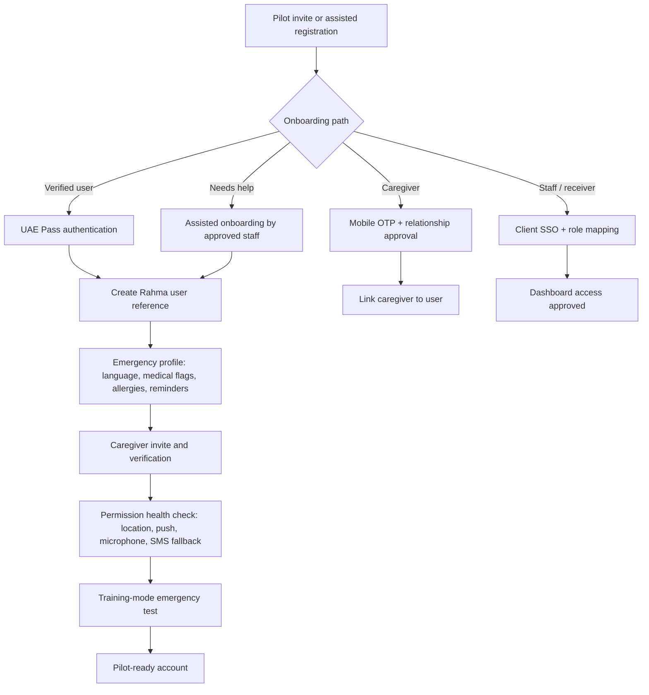

### Caregiver Onboarding Flow

Caregivers should not get location or health context only because they know a phone number. They should be linked through an approved relationship flow.

Recommended caregiver flow:

1. User, pilot staff, or approved admin adds caregiver phone number.
2. Caregiver receives invite by SMS.
3. Caregiver verifies mobile number through OTP.
4. Caregiver accepts role, privacy notice, and emergency alert responsibility.
5. User/staff/admin approves caregiver relationship.
6. Caregiver receives access only to the minimum information required for their role.
7. Every location view and emergency event access is logged.

### Permission Health Check

The onboarding process should not finish until the app confirms the phone is ready for emergency use.

Required checks:

- Location permission.
- Push notification permission.
- Microphone permission for voice prompts/intent support.
- SMS fallback availability based on device and platform rules.
- Battery optimization warning on Android where needed.
- Background location behavior test where approved.
- Caregiver alert test in training mode.
- Last-known location saved successfully.

### Our Final Recommendation

Use a hybrid onboarding model:

- Primary user identity: UAE Pass if approved.
- Elderly-friendly fallback: assisted onboarding.
- Caregiver identity: mobile OTP plus relationship approval.
- Staff/dashboard identity: client SSO.
- Pilot exception path: manual admin onboarding only with audit trail.

This gives the client a strong verified identity path without blocking elderly users who may need help completing onboarding.

## 7B. Recommended Native Mobile and Offline Stack

### Recommended iOS Stack

Recommended: Swift + SwiftUI.

Why:

- Best access to iOS emergency-critical capabilities: Core Location, background location permissions, haptics, APNs push notifications, Keychain, encrypted local storage, accessibility APIs, and future Apple Watch/watchOS support.
- SwiftUI allows a clean, accessible, large-control interface while still allowing UIKit/native modules where deeper device control is needed.
- Better long-term maintainability for a government/health-style safety app than wrapping critical device behavior through a cross-platform layer.

Recommended iOS components:

- UI: SwiftUI with selected UIKit bridges only where needed.
- Location: Core Location with clear permission onboarding and last-known location fallback.
- Secure local storage: Keychain for secrets/tokens and encrypted local database/cache for minimal emergency profile and queued events.
- Push: Apple Push Notification service through the backend notification service.
- Watch expansion: watchOS companion app after Phase 1 if wearable scope is approved.
- Offline voice proof: Apple on-device speech where suitable, with WhisperKit as a proof-of-concept option for selected devices if offline Arabic/English testing shows acceptable performance.

### Recommended Android Stack

Recommended: Kotlin + Jetpack Compose.

Why:

- Best access to Android emergency-critical capabilities: background/foreground services, WorkManager, background location, notification channels, SMS intent behavior, encrypted storage, accessibility, and future Wear OS support.
- Jetpack Compose gives a modern native UI model while Kotlin gives strong support for coroutines, state handling, and device APIs.
- Android behavior varies widely across device brands, so direct native implementation is safer for permissions, background execution, and offline fallback testing.

Recommended Android components:

- UI: Kotlin + Jetpack Compose.
- Background work: WorkManager for deferred sync and retry jobs.
- Location: Fused Location Provider where approved, with GPS/network/last-known fallback.
- Secure local storage: EncryptedSharedPreferences / Android Keystore and encrypted local database/cache.
- Push: Firebase Cloud Messaging through the backend notification service.
- Wearable expansion: Wear OS companion integration after selected device support is confirmed.
- Offline voice proof: Android on-device SpeechRecognizer where reliable, with whisper.cpp as a proof-of-concept option if device performance and language testing are acceptable.

### Shared Mobile Engineering Approach

Recommended:

- Keep the apps native, but share contracts and standards.
- Use a common API contract so iOS and Android send and receive the same backend data formats.
- Use shared event names and emergency event state definitions.
- Use shared design rules for colors, typography, spacing, and accessibility states.
- Use shared test scenarios for emergency activation, no response, weak GPS, no internet, denied permissions, and SMS fallback.

Not recommended for Phase 1:

- Flutter or React Native for the emergency-critical app shell, because Rahma depends heavily on native permissions, background behavior, local fallback, location accuracy, SMS handling, and future wearables.
- Full Kotlin Multiplatform or shared UI in Phase 1. It can be reviewed later for non-critical shared logic, but the first pilot should keep device-critical behavior directly native.

### Offline Mode Stack

Recommended offline design:

- Button activation always works.
- App creates a local emergency event immediately.
- App reads a minimal encrypted local emergency profile.
- App captures current GPS/network location if available.
- If no current location is available, app uses last-known location with timestamp and confidence.
- If internet is unavailable, app triggers SMS fallback using approved content.
- App queues the event locally and syncs when connectivity returns.
- Offline voice supports only simple prompts, yes/no, and high-confidence phrase spotting.

Recommended on-device AI / voice options:

| Area | Preferred path | Backup / proof option | Recommendation |
|---|---|---|---|
| iOS offline voice | Apple on-device speech where suitable | WhisperKit | Use for simple emergency phrases only after device/language testing. |
| Android offline voice | Android on-device SpeechRecognizer where reliable | whisper.cpp | Use only for simple commands; do not rely on it for medical decisions. |
| Offline intent logic | Rules engine | Lightweight phrase spotting | Button, silence, fall, and high-risk profile should override AI uncertainty. |
| Offline storage | Platform encrypted storage | SQLCipher/encrypted local DB | Store minimum profile, contacts, last location, and unsynced event logs only. |

### SMS Provider Recommendation

Recommended provider order:

1. Primary: AWS End User Messaging SMS / Amazon SNS if the backend is hosted on AWS UAE. This keeps messaging operations close to the cloud architecture, monitoring, IAM, and event logging.
2. Secondary / backup: Twilio or Infobip if the client wants multi-provider failover, separate vendor routing, or stronger regional messaging support.
3. Optional local route: client-approved telecom or aggregator provider if required by the client or authority partner.

Important SMS design rules:

- Use registered sender IDs and approved message templates.
- Keep emergency SMS short and structured.
- Avoid unnecessary medical details in SMS.
- Include user reference, emergency status, timestamp, and location only to the level approved by the client.
- Use secure short-lived links only if URLs are approved during sender registration.
- If URLs are not approved, send coordinates or last known area and ask the receiver to use the dashboard.
- Track delivery receipts, retry attempts, fallback provider usage, and failure reasons.

Recommended fallback SMS examples, subject to client approval:

```text
RAHMA ALERT: Emergency activated for User Ref RHM-1024 at 10:42. Last location: 25.2048,55.2708. Open dashboard for details.
```

```text
RAHMA ALERT: User Ref RHM-1024 needs help. Internet unavailable. Last known area: Dubai Marina, 10:39. Open receiver dashboard.
```

### Visual App Direction

The mobile app should feel calm, trustworthy, and extremely simple. The user should see one dominant Rahma button, clear status text, and two large answer buttons when needed.

Recommended visual direction:

- Large circular emergency button with strong contrast.
- Arabic/English typography tested for elderly readability.
- High contrast background with no decorative clutter.
- Clear status states: Ready, Contacting help, Alert sent, Caregiver acknowledged, Offline fallback active.
- Large yes/no buttons for users who cannot speak.
- Haptic feedback and sound confirmation after press-and-hold activation.
- Caregiver mode should use a calmer dashboard view with location, status, SMS, acknowledge, and escalation actions.

---

### 7.1 API Gateway

Purpose:

- Single entry point for mobile apps, dashboards, and partner integrations.
- Authentication, rate limiting, request validation, routing, and API versioning.

Recommended implementation:

- Managed API Gateway in the selected hosting environment.
- Separate APIs for mobile, receiver dashboard, admin console, and partner integrations.
- Strong service-to-service authentication.

### 7.2 Identity and Role Service

Initial roles:

- Elderly/special-care user.
- Caregiver/family member.
- Support/admin user.
- Receiver/authority user, depending on approved operating model.

Phase 2 roles:

- Child.
- Parent/guardian.
- School receiver.
- Pharmacy user.
- Clinical reviewer, if required for approved scripts or language packs.

Recommended approach:

- Use UAE Pass for verified user onboarding if the client confirms access and suitability.
- Use mobile OTP plus manual/assisted verification as fallback.
- Use client/government SSO for staff/admin users if provided.

### 7.3 Profile and Consent Service

Stores user profile, caregiver relationship, emergency details, and approved data-sharing preferences.

Phase 1 profile fields:

- User reference ID.
- Name/display identifier.
- Primary language.
- Emergency contacts.
- Caregiver relationship.
- Critical medical flags.
- Allergies.
- Mobility or communication needs.
- Medication reminder preferences.
- Last profile update timestamp.

Design principle:

- Store minimum necessary information.
- Separate sensitive medical details from general profile where possible.
- Keep every access auditable.
- Make retention and sharing rules configurable based on client-confirmed requirements.

### 7.4 Emergency Event Service

Core service for activation, status, receiver updates, escalation, and event lifecycle.

Event statuses:

- Created.
- Location captured.
- Alerts sent.
- Receiver acknowledged.
- Escalated.
- Cancelled as false alarm.
- Resolved.
- Failed delivery.
- Requires manual review.

### 7.5 Location Service

Purpose:

- Capture location with quality indicators.
- Provide short-lived live location links.
- Support Phase 2 geofencing.

Location data should include:

- Latitude/longitude.
- Timestamp.
- Source: GPS, network, last known, manual fallback.
- Accuracy/confidence.
- Device permission status.
- Battery/network condition if available.

Phase 1:

- Emergency-only location capture and sharing.
- Short-lived receiver links.

Phase 2:

- Safe zones.
- Entry/exit alerts.
- Configurable route history if approved.
- Parent/school-specific access controls.

### 7.6 Notification Service

Channels:

- Push notification.
- SMS.
- Dashboard alert.
- Email only for non-critical reports, not primary emergency delivery.

Notification features:

- Multi-channel fallback.
- Delivery tracking.
- Retry rules.
- Escalation chain.
- Quiet hours only for non-emergency reminders.
- Emergency alerts always prioritized.

### 7.7 Medication Reminder Service

Phase 1:

- Timely reminder notifications.
- Simple confirm/taken/skipped flow.
- Caregiver missed-dose notification if configured.

Phase 2:

- Pharmacy supply communication.
- Prescription refill request.
- Dosage schedule synchronization.
- Support dashboard for medication adherence exceptions.

### 7.8 Hospital Directory Service

Phase 1:

- Approved hospital/facility directory for Dubai and Abu Dhabi.
- Nearest facility suggestions based on current/last known location.
- Basic facility details and emergency contact.

Important note:

- Real-time bed availability or specialist availability should only be included if an approved reliable data source is available.

### 7.9 AI Orchestration Service

AI should support the workflow by understanding language and intent, but the emergency path must not depend entirely on AI confidence.

Recommended Phase 1 AI responsibilities:

- Language detection for Arabic/English.
- Intent classification for simple emergency categories.
- Voice-to-text or speech intent when online.
- Simple confirmation prompts.
- Confidence scoring.
- Scripted response selection.
- Audit of model/prompt version and final decision.

Not recommended in Phase 1:

- Free-form diagnosis.
- Complex medical triage without clinical approval.
- AI-only decision to suppress an emergency alert.

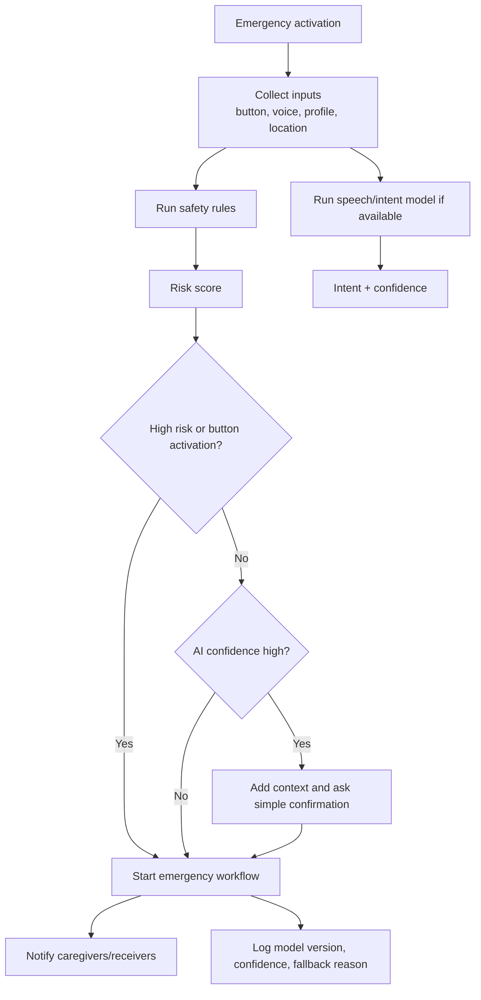

---

## 8. Recommended Server Architecture

### Preferred Option: AWS UAE Region with UAE-Hosted Foundation Model

This is the recommended option from our side for the Phase 1 pilot.

Why this is favorable:

- Faster implementation than custom infrastructure.
- Managed reliability, monitoring, backups, and scaling.
- Easier to support pilot and Phase 2 growth.
- A UAE-hosted foundation model can support higher-quality Arabic/English understanding, context capture, and safer prompt governance while keeping sensitive patient data inside the approved hosting boundary.
- Bedrock with Claude or an equivalent model is the preferred managed path where available; a UAE-hosted private model remains the fallback where dedicated hosting is mandated.
- Reduces the need to buy, host, maintain, and secure GPU servers.
- Better fit for a 16-week Phase 1 pilot.

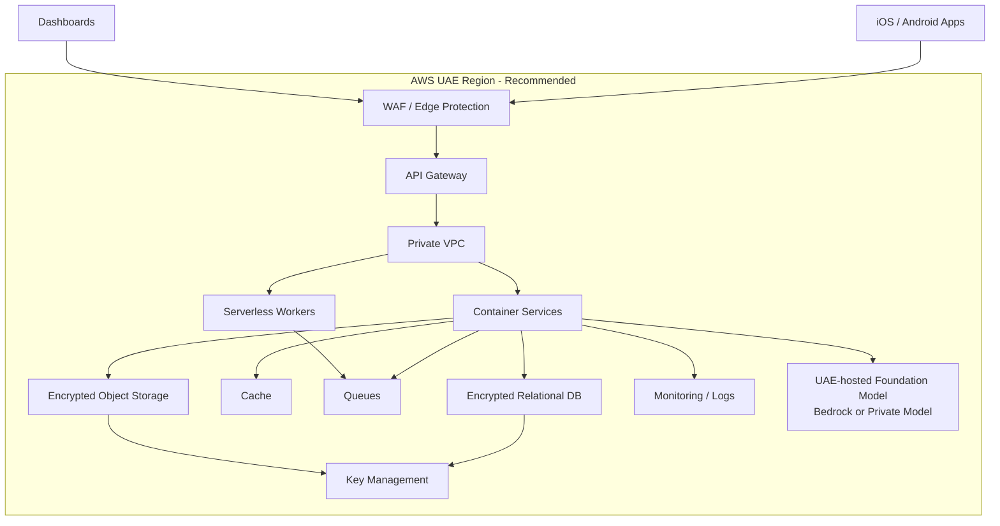

### Alternative Option: Custom On-Premises / Dedicated GPU Server

Use this only if the client requires a fully dedicated environment.

Benefits:

- Maximum control over infrastructure.
- Can satisfy strict client-owned hosting preference.
- Sensitive AI processing can be kept within dedicated servers.

Tradeoffs:

- Higher cost.
- Longer procurement and setup timeline.
- Requires GPU sizing, MLOps, patching, backups, monitoring, physical/network security, and 24/7 operations.
- Greater delivery risk for a short Phase 1 pilot.

### Alternative Option: Hybrid

Use managed cloud for core app services and a dedicated private AI server only for sensitive model workloads.

Benefits:

- Balances delivery speed and control.
- Allows AI workload isolation.
- Can be useful if the client approves cloud hosting for app data but wants stricter model control.

Tradeoffs:

- More integration complexity.
- More operational responsibility.
- Requires clear routing rules so sensitive data is processed only in approved locations.

---

## 9. Open Decisions, Options, and Recommended Path

| Topic | Option A | Option B | Option C | Recommended by us |
|---|---|---|---|---|
| Mobile technology | Native iOS + Android | Flutter | React Native | Native iOS + Android because device permissions, location, SMS fallback, background behavior, and wearables need stronger native control. |
| Hosting | AWS UAE Region + UAE-hosted foundation model | Custom on-prem / dedicated GPU | Hybrid cloud + private AI | AWS UAE Region with a UAE-hosted foundation-model layer, unless the client mandates dedicated hosting. |
| AI model usage | UAE-hosted foundation model | UAE-hosted private model | Self-hosted model | UAE-hosted foundation model for higher-quality Arabic/English understanding, with sensitive patient data kept inside approved UAE hosting. |
| Offline voice | Lightweight on-device model | Rules-only prompts | Full offline AI triage | Lightweight on-device model for simple commands and yes/no; no full offline medical triage in Phase 1. |
| Emergency integration | Direct approved API | Gateway/call-center handoff | Simulator/manual pilot | Use the client-confirmed authority/API route where available; keep dashboard, call-center, or manual handoff as approved fallback paths. |
| Onboarding | UAE Pass | Mobile OTP + assisted verification | Manual admin onboarding | UAE Pass if client confirms access; OTP/assisted verification as fallback. |
| Staff/admin login | Client SSO | Separate admin login | Manual accounts | Client SSO if available; otherwise separate admin login with MFA. |
| Location sharing | Short-lived secure link | Always-on tracking | SMS text location only | Short-lived secure link for Phase 1; SMS fallback when internet is unavailable. |
| Medication reminders | App reminders only | Caregiver escalation | Pharmacy-connected reminders | Phase 1 app reminders with optional caregiver escalation; Phase 2 pharmacy connection. |
| Child safety | Defer | Build after Phase 1 | Build immediately | Build after Phase 1 foundations are stable. |
| Wearables | Defer to later | Phase 2 controlled proof | Full support from launch | Phase 2 controlled proof after selected devices and APIs are confirmed. |
| Languages | Arabic/English only | 10 languages in Phase 2 | 10 languages in Phase 1 | Arabic/English in Phase 1; expand in Phase 2 with reviewer workflow. |

---

## 10. Phase 1 Implementation Plan

Recommended duration: 16 weeks, assuming client approvals, hosting access, and integration inputs are available on time.

### Weeks 1-2: Discovery, Scope Lock, and Architecture Confirmation

Outputs:

- Final Phase 1 scope and acceptance criteria.
- Confirmed hosting decision.
- Confirmed onboarding method.
- Confirmed emergency handoff path.
- Data inventory and retention assumptions.
- User roles and access model.
- UX wireframes for emergency flow.
- Integration discovery list.
- Project delivery plan and risk register.

### Weeks 3-6: Core Mobile App and Backend MVP

Outputs:

- Native iOS app MVP.
- Native Android app MVP.
- One-touch emergency activation.
- Local encrypted profile.
- Profile service.
- Emergency event service.
- Caregiver setup and verification flow.
- Push/SMS notification service.
- Hospital directory MVP.
- Admin/support dashboard MVP.

### Weeks 7-9: Offline, Emergency Routing, and Reliability

Outputs:

- Offline emergency event queue.
- SMS fallback.
- Last-known location fallback.
- SMS fallback and manual handoff flow.
- Receiver dashboard event lifecycle.
- Poor-connectivity test suite.
- False alarm cancellation/tagging flow.
- Notification retry and escalation rules.

### Weeks 10-12: AI, Security, Privacy, and Clinical Script Validation

Outputs:

- Arabic/English prompt library.
- Simple intent classification.
- Confidence/fallback policy.
- Approved scripted responses.
- Secure logging and audit review.
- Access control tests.
- Mobile permission tests.
- API security testing.
- Pilot support runbook.

### Weeks 13-16: Controlled Pilot Readiness and Launch

Outputs:

- Pilot onboarding workflow.
- Production deployment.
- Monitoring dashboards.
- Incident handling runbook.
- Support training.
- Pilot metrics dashboard.
- Phase 2 readiness backlog.
- Go/no-go checklist.

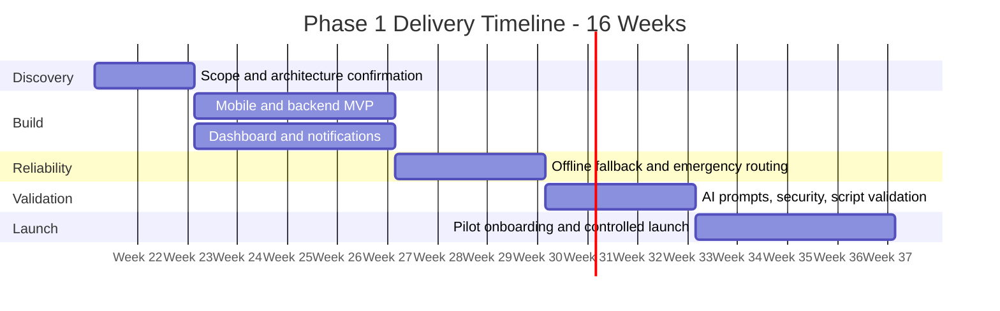

---

## 11. Phase 2 Implementation Plan

Recommended duration: 12-16 weeks after Phase 1 pilot metrics are reviewed.

Phase 2 should begin only after these Phase 1 items are stable:

- Emergency activation success rate.
- Notification delivery rate.
- Location quality.
- False alarm handling.
- Support workload.
- Dashboard usability.
- Hosting and monitoring readiness.
- Identity and consent model.
- Localization process.

Phase 2 workstreams:

1. Children and guardian module.
2. Geofencing and safe zones.
3. School/authorized receiver workflows.
4. Pharmacy communication and medication supply.
5. Multilingual expansion.
6. Wearable proof of integration.
7. Scale and operations readiness.

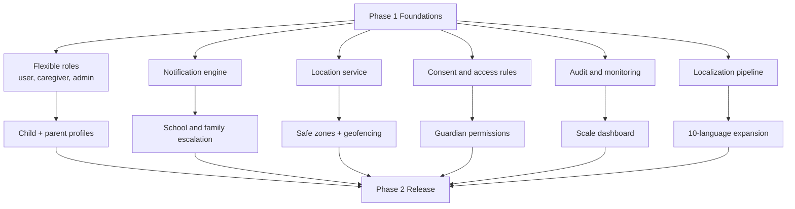

---

## 12. Data Flow and Storage

### Phase 1 Data Categories

| Data category | Example | Storage approach | Notes |
|---|---|---|---|
| Identity data | User reference, caregiver reference | Encrypted database | Keep minimum necessary fields. |
| Emergency profile | Medical flags, allergies, language | Encrypted database and minimal encrypted device cache | Device cache only for emergency fallback. |
| Location data | Current/last known GPS, timestamp, accuracy | Event-linked storage | Share through short-lived links. |
| Emergency event | Activation source, status, timeline | Event database + audit log | Immutable audit trail for critical actions. |
| Notifications | Push/SMS status, retries, delivery | Notification logs | Avoid sensitive payloads where possible. |
| Voice/transcripts | Intent and confidence | Store only derived metadata by default | Raw audio should be avoided unless approved. |
| Medication reminders | Schedule, taken/skipped status | Reminder service database | Phase 2 can add pharmacy communication. |

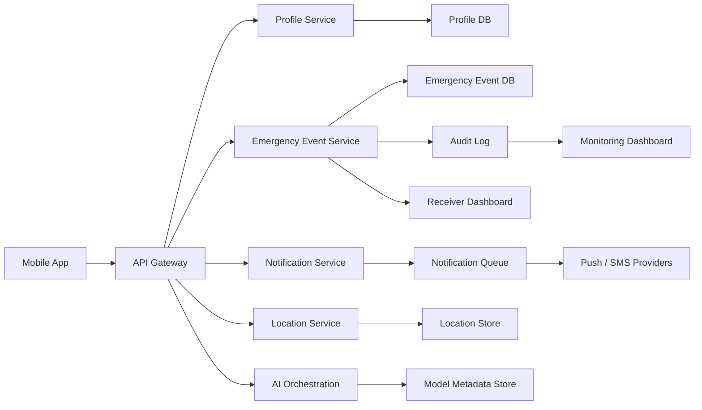

---

## 13. Client-Specified Requirement Handling

Rahma will handle sensitive user, health, location, caregiver, and emergency event data. Before production launch, the client should confirm the exact audit, security, data residency, privacy, operational, and documentation requirements they expect the system to meet.

Our implementation approach:

- Meet any compliance or audit requirement specifically confirmed by the client or relevant authority stakeholders.
- Keep production data inside the client-approved hosting boundary.
- Encrypt sensitive data in transit and at rest.
- Use role-based access controls.
- Use multi-factor authentication for privileged users.
- Keep access and emergency actions auditable.
- Store minimum necessary personal and health information.
- Avoid storing raw voice/audio unless formally approved.
- Define retention rules before pilot launch.
- Maintain incident response and support runbooks.
- Prepare evidence artifacts only for the standards or reviews the client specifically asks us to follow.

This approach keeps the product ready for formal review without over-committing to a specific framework before the client confirms the required one.

---

## 14. Operational Model

Phase 1 requires operations, not just software.

Required operational functions:

- Pilot onboarding support.
- Caregiver verification.
- Emergency event monitoring.
- False alarm review.
- Failed notification follow-up.
- User support for permissions and device settings.
- Incident response.
- Dashboard monitoring.
- Weekly pilot reporting.

Recommended dashboards:

- Active users.
- Emergency activations.
- Alert delivery time.
- Receiver acknowledgement time.
- Location quality.
- SMS fallback rate.
- Failed notifications.
- False alarm rate.
- App crash rate.
- Offline event sync delays.
- Support tickets by category.

---

## 15. Key Risks and Mitigation Plan

| Risk | Impact | Mitigation |
|---|---|---|
| Emergency API access is delayed | Pilot launch blocked if direct integration is mandatory | Build simulator/manual handoff path in parallel. |
| AI misunderstands distressed speech | Wrong context or delay | Button activation starts emergency flow regardless of AI confidence. |
| Weak GPS indoors | Incomplete location | Use GPS, network location, last known location, timestamp, and confidence. |
| Internet unavailable | Push/API path fails | Use local event creation, SMS fallback, receiver dashboard/manual handoff, and later sync. |
| Caregiver access misconfigured | Privacy and trust issue | Verify caregivers, use RBAC, short-lived links, and audit access. |
| False alarms increase support load | Operational strain | Use press-and-hold, cancellation window, false alarm tagging, and analytics. |
| Phase 2 added too early | Rework and delays | Complete Phase 1 foundations first. |
| Pharmacy/school integrations vary | Phase 2 delays | Start partner discovery during Phase 1. |
| Multilingual quality issues | User confusion or unsafe prompts | Use approved phrase library and reviewer workflow. |
| Custom hosting required | Higher cost and timeline | Prepare separate infrastructure proposal if client rejects managed cloud. |

---

## 16. Acceptance Criteria

### Phase 1 Go-Live Criteria

- User can activate emergency flow using the large button.
- App captures current or last known location with timestamp.
- Emergency event is created and visible in receiver dashboard.
- Caregiver receives alert through push or SMS fallback.
- Offline event is queued and synced when internet returns.
- Arabic and English prompts are available.
- Medication reminders work for configured users.
- Admin can review emergency timeline and notification status.
- Access control and audit logging are active.
- Support team has a launch runbook.
- Pilot monitoring dashboard is live.
- Client confirms hosting, onboarding, and handoff decisions.

### Phase 2 Readiness Criteria

- Phase 1 pilot metrics meet agreed thresholds.
- Identity model supports children, guardians, schools, and pharmacies.
- Consent and access model supports child and pharmacy workflows.
- Notification service supports escalation rules.
- Location service supports geofencing safely.
- Localization process supports additional language review.
- Partner integration requirements are confirmed.
- Support operations can handle increased user volume.

---

## 17. Immediate Decisions Needed From Client

1. Hosting preference: AWS UAE Region with a UAE-hosted foundation-model layer, dedicated on-premises infrastructure, or hybrid.
2. Onboarding preference: UAE Pass, mobile OTP, client SSO, or assisted/manual onboarding.
3. Patient information data access method linked to UAE Pass: approved API, secure client integration, controlled data feed, or manual pilot import.
4. Emergency handoff model for Phase 1: direct API, gateway/call-center, dashboard receiver, simulator, or manual handoff.
5. SMS payload approval: what information can be sent through SMS during fallback.
6. Receiver roles: who receives Phase 1 alerts: family, authority, support center, healthcare team, or a combination.
7. Hospital directory source: approved facility data source for Dubai and Abu Dhabi.
8. Medication reminder scope: reminders only in Phase 1, or caregiver missed-dose escalation as well.
9. Voice/audio retention: whether raw audio can be stored, or only derived intent metadata.
10. Phase 2 priority order: children, geofencing, pharmacy, languages, or wearables.
11. Any specific audit, security, data residency, or documentation requirements to be met.

---

## 18. Final Recommendation

Rahma should proceed with a disciplined Phase 1 pilot focused on emergency reliability, accessibility, location capture, caregiver/receiver alerting, medication reminders, auditability, and operational readiness.

The most favorable technical path is native iOS and Android apps, AWS UAE Region with a UAE-hosted foundation-model layer, constrained on-device offline logic, SMS fallback, reusable backend services, and a receiver dashboard. This gives the client a strong, understandable, and realistic foundation while keeping Phase 2 expansion possible without rebuilding the platform.

Phase 2 should be approved after Phase 1 validates real-world activation, alert delivery, location quality, false alarm management, support capacity, and the agreed hosting/requirement model.
